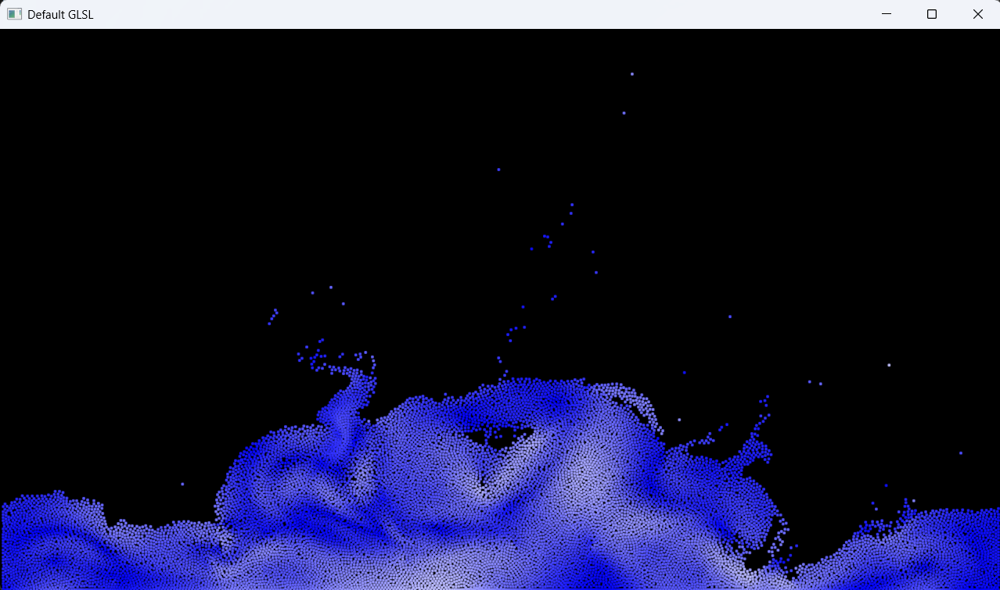

## Overview

### App showcase

**FLIP Simulation** \

15.000 particles, 70 000 cells running on an i5-12450HX in parallel on 12 threads. \
~ 35fps / 30ms

## Technical Details

### Libraries used
- glad
- glfw
- glm
- imgui
- KHR
